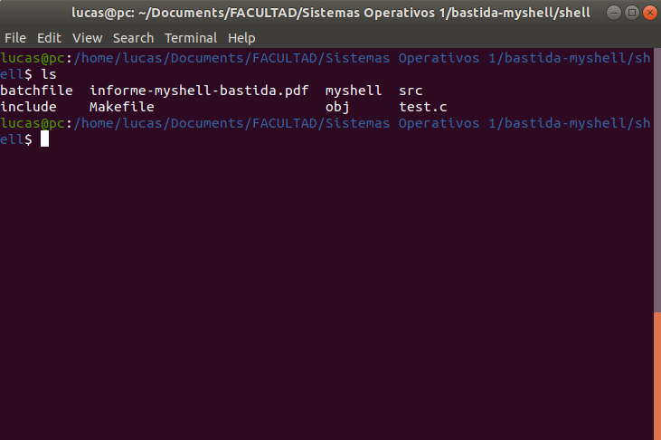

# Shell
Command-line interpreter.

It has the ability to read and evaluate commands from a file passed in as argument.
If it's executed without arguments it will print a command prompt and wait for user input.



## Project Objectives
- using linux mechanisms for creating processes
- use linux IPC and concurrency mechanisms
- design a command line interpreter similar to BASH

# Compilation & execution

In the project directory, where Makefile is located, type the following to compile & link object files:
```
make
```

Clean object files and remove executable:
```
make clean
```

## How to use
Type the following to run in command prompt mode (asks the user for input):
```
./myshell
```

To run commands line by line from a file (batchfile is an example file in the project)
```
./myshell batchfile
```

# Background execution and I/O redirection:
**To run the process in the background** you can append a "&" to the end of the line. 

note: When entering a command, it will wait for that command process to finish before taking the next input.

For example:
```
firefox &
```

It also **supports input/output redirection** using the "<" ">" characters respectively.

for example:
```
echo text test > testfile
```


# Architecture explanation 
The program is divided in the following modules:
- internal commands
- main file
- process exec
- string functions

The **process exec file** has the functions necessary to execute the user commands using fork() and an implemented exec() command. These take as parameter the user command string divided into an array of tokens. It has the ability to run a command in the background other than waiting for the process to finish and. First it evaluates the internal commands and if the user didn't run one of these, it will search in you PATH environment variable directories for the necessary executable.

The **internal commands file** stores implemented internal commands, other than executing another program, to process the user commands.
The personalized commands are:
- "**cd \<directory>**" where \<directory>:= is the desired directory (must have no whitespace)
- "**clr**" which cleans the terminal screen
- "**echo \<commentary>**" \<commentary>:= string you want to print to stdout
- "**quit**" closes myshell

The **String function file** contains the functions which divides the user input string into tokens and a function that reads from stdin if the program isn't ran with a batchfile as argument.

the **main file** just decides how the program will run. Processing commands from a file or asking for user input similar to a terminal.